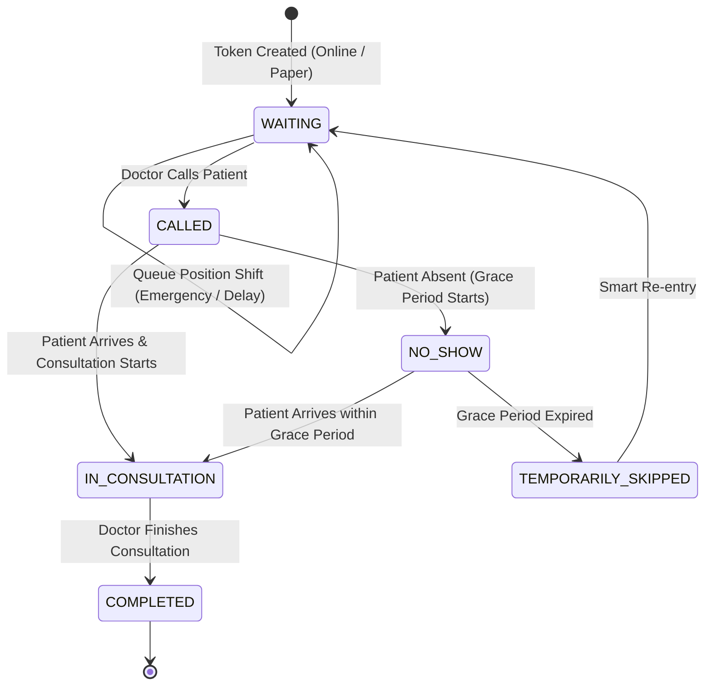

# Aarogya — Central Queue Engine Documentation

**Team:** AstraBytes  
**Core Module:** `server/src/services/QueueService.js` & `server/src/services/TokenService.js`

---

## 1. Unified Queue Architectural Principles

In standard government hospital OPDs, digital registrations and walk-in paper slips are frequently treated as disconnected queues, resulting in desk disputes, overcrowding, and unpredictable waiting times. 

Aarogya enforces **Three Golden Rules** in its central queue engine:

1. **Strictly ONE Unified Queue:** Online tokens (`O101`), Staff-entered walk-in paper tokens (`P102`), and Emergency cases (`E001`) reside in the identical queue data structure.
2. **Dynamic Position Derivation:** A token's `queuePosition` is never static. It is dynamically computed based on priority (`priority = 2` for emergency, `1` for priority, `0` for regular) and arrival time (`joinedAt`).
3. **Continuous Re-forecasting with Event Gating:** Any state change (call, completion, emergency, delay, re-entry) dispatches a domain event through the central pipeline to recalculate downstream ETAs.

---

## 2. Queue Lifecycle State Machine



---

## 3. Central Event Pipeline Workflow

When any queue mutation occurs:

```
                  +-------------------------+
                  |  Queue Mutation Action  |
                  +------------+------------+
                               |
                               v
                  +-------------------------+
                  | Acquire Redis Mutex     |
                  | Lock on Session         |
                  +------------+------------+
                               |
                               v
                  +-------------------------+
                  | Update MongoDB Record   |
                  +------------+------------+
                               |
                               v
                  +-------------------------+
                  | Recalculate Positions   |
                  | priority DESC, date ASC |
                  +------------+------------+
                               |
                               v
                  +-------------------------+
                  | Call Prediction Engine  |
                  | (FastAPI / Fallback)    |
                  +------------+------------+
                               |
                               v
                  +-------------------------+
                  | Delta >= 5 mins?        |
                  +----+---------------+----+
                       |               |
             YES (Major|               |NO (No Major
                Change)|               |   Change)
                       v               v
            +----------------+   +-------------------+
            | Dispatch SMS   |   | Suppress SMS to   |
            | & IVR Alerts   |   | Avoid Spamming    |
            +--------+-------+   +---------+---------+
                     |                     |
                     +----------+----------+
                                |
                                v
                  +-------------------------+
                  | Broadcast Socket.IO to  |
                  | Session & Display Board |
                  +------------+------------+
                               |
                               v
                  +-------------------------+
                  | Write Immutable Audit   |
                  | Record in AuditLog      |
                  +------------+------------+
                               |
                               v
                  +-------------------------+
                  | Release Session Lock    |
                  +-------------------------+
```

---

## 4. Operational Safety Policies

### 4.1 Ongoing Consultation Protection
An emergency patient arrival (`E001`) or priority override will **never** blindly interrupt an ongoing consultation (`IN_CONSULTATION`). The doctor finishes treating the current patient undisturbed; the emergency patient is placed at rank #1 among waiting patients.

### 4.2 Smart No-Show Grace Period
Absent patients are not deleted or cancelled when their token is called. The system activates a **10-minute grace period** and sends an urgent SMS notification. If the grace period expires without arrival, the token status transitions to `TEMPORARILY_SKIPPED` and is moved aside, allowing the doctor to proceed with other waiting patients.

### 4.3 Smart Re-entry
When a skipped patient returns from a diagnostic lab, pharmacy, or restroom, desk staff executes a **Smart Re-entry**. The patient is restored to an active `WAITING` state and queued according to hospital policy without having to pay or register a new token.
